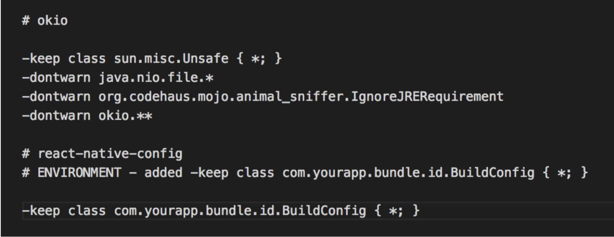

# react-native-env
Guide on how to set up env for react native

## Used for set up:
-Android productFlavors
-IOS scheme
-react-native-config

###Warning
*  use only "dev" scheme/productFlavor for development,  "staging"/"prod" are going to be used while QA/Production
*  For iOS  only "dev" scheme is debuggable, "stage"/"production" are signed via release configs

## How to use
####Android
##### Run on device/emulator (debug mode)
1. `npm run  react-native run-android --variant=devDebug` (uses config from .env.dev)
2. `npm run  react-native run-android --variant=stagingDebug` (uses config from .env.staging)
3. `npm run  react-native run-android --variant=prodDebug` (uses config from .env.prod)

**After success build you can see  error:**
 `Intent { cmp=com.app/.MainActivity } Error type 3 Error: Activity class {com.app/com.app.MainActivity} does not exist`
 - but it's ok, just launch application on  device/emulator**
 
 ##### Assembling build (release mode)
 1. `npm run  react-native run-android --variant=assembleDevRelease` (uses config from .env.dev)
 2. `npm run  react-native run-android --variant=assembleStagingRelease` (uses config from .env.staging)
 3. `npm run  react-native run-android --variant=assembleProdRelease` (uses config from .env.prod)

####IOS
**NOT use `react-native run-ios`**
#####Running on simulator/real device (release mode):
1. Choose schema
2. Run on device/simulator

#####Assembling build (release mode):
1. Choose schema
2. Run "Product/Archive";

1.Running on simulator/real device (use schema for needed environment)
2.

##Make changes

###Android
* `react-native-config` - basic link changes (MainApplication.java, settings.gradle, android/app/build.gradle);
* `android/app/build.gradle`

* `proguard-rules.pro`

- added `app/src/dev/res/values/strings.xml` for "dev" productFlavor - for bundle name `DEV-app`;
- added `app/src/stage/res/values/strings.xml` for "stage" productFlavor - for bundle name `STAGING-app`;
- added `app/src/production/res/values/strings.xml` for "production" productFlavor - for bundle name `app`;
